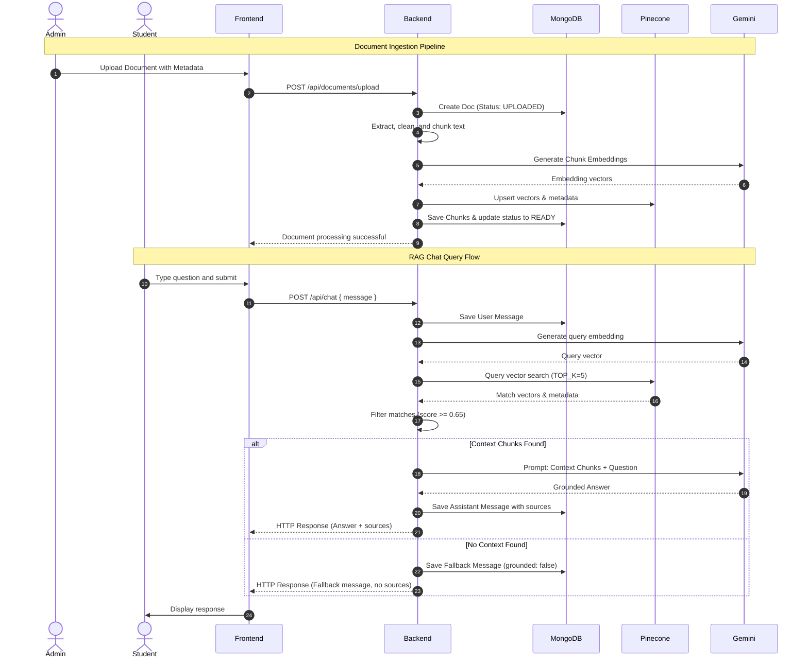

# CollegeRAG – AI-Based RAG College Information Chatbot

Welcome to the documentation for **CollegeRAG**, a full-stack, AI-powered college information assistant built using Retrieval-Augmented Generation (RAG). This chatbot is designed to provide students with accurate, grounded answers to their questions based *only* on the college's official knowledge base (documents, FAQs, guidelines, etc.) uploaded by administrators, preventing hallucinations and general-knowledge drift.

---

## 1. Project Overview

### What is CollegeRAG?
CollegeRAG is a full-stack web application that serves as an intelligent college information assistant. It allows college administrators to upload institutional documents (PDFs, DOCX files, notices, calendars) and processes them into a vector search engine. Students can then interact with a modern chat interface, asking questions about exam dates, fee structures, hostel rules, or admission guidelines.

### What Problem Does it Solve?
Colleges store critical information across disjointed notices, multi-page PDF guidelines, scattered FAQs, and distinct department webpages. Finding specific answers (e.g., hostel timings, refund policies, exam fee deadlines) is tedious and error-prone for students. CollegeRAG consolidates these documents into a single chat interface.

### Who Uses the System?
1. **Students**: Registered users who converse with the chatbot, view source citations, and manage their conversation history.
2. **Administrators**: Authorized users who manage the knowledge base (upload, reprocess, and delete documents) and monitor processing statistics.

### Why is a College Information Chatbot Useful?
It provides 24/7 instant support for repetitive student queries, decreases administrative load, ensures consistent distribution of rules/guidelines, and delivers exact source citations so students can verify the information themselves.

### Why RAG (Retrieval-Augmented Generation) instead of a Normal Chatbot?
A generic chatbot trained on general internet data does not know a specific college's policies, fees, or dates. Fine-tuning is expensive and becomes obsolete as dates/policies change. RAG solves this by retrieving the exact, current text chunks relevant to the user's query from the vector database and injecting them into the LLM prompt as context. This makes the LLM's responses highly accurate, verifiable, and bounded.

### What Types of College Information Can Be Stored?
- Admission guidelines, eligibility criteria, and required documents.
- Academic calendars, semester schedules, exam periods, and holidays.
- Fee structures, payment modes, and deadline announcements.
- Hostel guidelines, timings, leave policies, and visitor rules.
- Library opening hours, lending policies, and fine structures.
- Placement criteria, registration policies, and training materials.
- Scholarship availability, applications, and general policies.

### What the Final System Allows Users to Do:
- **Students**: Sign up, log in, open/close/delete chat sessions, ask questions, get grounded answers, view source citations with page numbers, and review historical conversations.
- **Administrators**: Log in, upload PDF/DOCX files, monitor status (`UPLOADED`, `PROCESSING`, `READY`, `FAILED`), search and filter documents, reprocess files, delete documents (which automatically purges vector indices), and check system health.

---

## 2. Problem Statement

At modern colleges, information asymmetry and access friction are persistent issues. Critical data is scattered across:
- PDF circulars uploaded to notices portals.
- Academic calendar files stored on department pages.
- Admission handouts distributed during registration.
- Bulletins regarding hostel administration and libraries.

For students, parsing dozens of multi-page documents to answer a simple question like *"Can my parents visit me at the hostel on Sundays?"* or *"What is the fine for keeping a library book overdue for 5 days?"* takes considerable effort. 

CollegeRAG solves this by implementing a unified, AI-powered system that accepts raw PDF/DOCX files, extracts and structures the information, generates embeddings, stores them in a vector database, and uses a Retrieval-Augmented Generation pipeline to answer user questions using only the official knowledge base as the ground truth.

---

## 3. Project Objectives

Based on `specs.md`, the key objectives of CollegeRAG are:
1. **AI-Powered College Information Retrieval**: Build a system that generates precise, student-friendly answers based exclusively on official college documents.
2. **Document Ingestion**: Create an automated pipeline for admins to upload, parse, clean, chunk, and index PDF and DOCX files.
3. **Semantic Search**: Enable high-accuracy vector searches over document chunks using Pinecone and Gemini embeddings.
4. **Grounded RAG Execution**: Prevent LLM hallucinations by using strict prompt grounding and returning an "unavailable" response if the information is missing from the database.
5. **Source-Based Answers**: Ensure transparency by returning and displaying clickable source citations (document title, page, relevance score, excerpt) for every response.
6. **Robust Authentication**: Implement secure JWT-based authentication and role-based access control (RBAC) separating Students and Admins.
7. **Admin Management Dashboard**: Provide full control to view, upload, search, filter, reprocess, and delete knowledge base files.
8. **Chat History Persistence**: Store conversations and message histories (including sources used) in MongoDB, allowing students to continue past sessions.
9. **Deployment & Security**: Deploy the integrated application securely using environment configuration, input/file validators, Helmet security headers, rate limiting, and users' data isolation.

---

## 4. Key Features

The following features are categorized according to their requirement priority in the project specification.

### Mandatory/Core Features (MUST HAVE)

#### 1. Authentication & Security
- Student registration & login, password hashing using `bcryptjs`.
- Admin login using pre-authorized credentials or role mappings.
- JWT-based authentication stored/managed on the frontend with Zustand.
- Role-based route protection on both frontend and backend (Admins only for document management).
- Environment secret storage and rate limiting on sensitive auth endpoints.

#### 2. Admin Document Management
- Support for uploading PDF and DOCX files.
- Metadata forms capturing Display Title, Category, Department, and Description.
- Ingestion pipeline tracking states: `UPLOADED` -> `PROCESSING` -> `READY` / `FAILED` (with error message logs).
- Document deletion, which automatically triggers cascading deletion of MongoDB chunk records and Pinecone vector embeddings.
- Reprocess/Update action to re-extract, re-chunk, and re-embed documents.

#### 3. Document Ingestion Pipeline
- Extract text from PDFs using `pdf-parse` and DOCX using `mammoth`.
- Preprocessing and cleaning of extracted text (whitespace normalisation, non-ASCII cleaning).
- Fixed-size chunking (configurable: ~800–1000 tokens) with overlap (~100–150 tokens) to preserve contextual boundaries.
- Vector embedding generation using Google Gemini embedding model.
- Document and chunk metadata mapping (document ID, page/section, chunk index, text content).

#### 4. Semantic Search & RAG Service
- Direct similarity search in Pinecone returning the top `k` relevant chunks (default `TOP_K = 5`).
- Query validation, query embedding, and filtering using a configurable relevance score threshold (default `MIN_RELEVANCE_SCORE = 0.65`).
- Grounded prompts for the Gemini API, forcing it to reject general knowledge and respond with a fallback message when no context is found.
- Response construction returning both the generated text and structured source cards.

#### 5. Chat Interface & History
- Modern chat UI with conversation list sidebar, message log, source cards, and loading skeletons.
- Ability to start new chats, continue existing conversations, and delete conversations.
- MongoDB persistence for conversations and messages (including grounding flags and sources).

---

### Bonus Features (OPTIONAL/BONUS)
These features will only be explored after the mandatory features are fully completed and verified:
- **Multiple Document Collections**: Splitting queries or indexing by category/department.
- **Source Highlighting**: Visually highlighting retrieved excerpts inside the document viewer.
- **Confidence Scores**: Explicitly rendering similarity percentage values to the user.
- **Multilingual Support**: Handling questions and documents in regional languages.
- **Suggested Questions**: Dynamically suggesting queries based on the category/page the user is on.
- **Streaming Responses**: Token-by-token streaming from Gemini to the frontend.
- **OCR Integration**: Supporting scanned PDFs via Tesseract or Google Cloud Vision.

---

## 5. Technology Stack

| Technology | Purpose | Where it is Used | Why it is Required |
| :--- | :--- | :--- | :--- |
| **Next.js (Pages Router)** | Client framework | Frontend application | Clean routing, structured pages, fast compilation, and reliable React rendering. |
| **React 19** | Component library | Frontend UI | Declarative UI creation, state-driven rendering, and modern hook support. |
| **Tailwind CSS** | Styling engine | Frontend styles | Utility-first styling for quick, responsive, modern, and beautiful layouts. |
| **Zustand** | State management | Frontend application | Lightweight, high-performance global state management for auth and chat history. |
| **Axios** | HTTP client | Frontend services | Connecting client components to backend APIs with interceptors for JWT injection. |
| **Lucide React** | Icon library | Frontend UI | Rich, lightweight svg iconography matching modern design aesthetics. |
| **Node.js** | Runtime environment | Backend server | Scalable, non-blocking asynchronous JavaScript execution for APIs. |
| **Express.js** | Web framework | Backend server | Standard API routing, middleware chaining, and server initialization. |
| **MongoDB Atlas** | Database | Backend persistence | Flexible document storage for users, metadata, chats, messages, and chunk logs. |
| **Mongoose** | ODM | Backend database layer | Structured schema modeling, validation, and database operations. |
| **JSON Web Tokens (JWT)** | Token standard | Auth middleware | Secure, stateless user authentication and role verification across API calls. |
| **bcryptjs** | Password hashing | Auth service | Standard cryptographic hashing to secure passwords prior to database insertion. |
| **helmet** | Security headers | Backend middleware | Setting essential HTTP response headers to safeguard against common exploits. |
| **express-rate-limit** | Rate limiting | Backend middleware | Safeguarding authentication and API endpoints against brute force attacks. |
| **multer** | File upload handler | Ingestion controller | Multi-part form data parsing to handle PDF/DOCX file uploads securely. |
| **pdf-parse** | PDF reader | Ingestion service | Parsing and extracting raw text content from uploaded PDF guidelines. |
| **mammoth** | DOCX reader | Ingestion service | Extracting structured HTML/plain text from Word files without layout junk. |
| **Google Gemini API** | LLM Engine | RAG Service | Grounded answer generation and content translation. |
| **Gemini Embeddings** | Embedding model | Embedding Service | Vectorizing text chunks and search queries using the same semantic space. |
| **Pinecone** | Vector database | Vector Service | High-performance storage and cosine-similarity search for millions of vector dimensions. |
| **LangChain** | Ingestion & Retrieval | Ingestion/Vector | Parsing, chunking utilities, and clean interfaces for document processing. |

---

## 6. System Architecture

CollegeRAG uses a structured, three-tier architecture:
1. **Presentation Layer (Next.js)**: Responsible for rendering the Landing Page, Login, Register, Student Dashboard, Chat Interface, and Admin Panel. It manages client-side state using Zustand and interacts with the Backend via Axios.
2. **Application Logic Layer (Express API)**: Validates requests, manages authentication/authorization, processes uploaded files, chunks documents, runs embedding engines, orchestrates the retrieval flow, constructs context prompts, and queries Gemini.
3. **Storage & AI Layer (MongoDB, Pinecone, Gemini)**: MongoDB Atlas holds user credentials, chat histories, document summaries, and chunk metadata. Pinecone hosts the multi-dimensional vector embeddings of the document chunks. Google Gemini performs natural language generation and embedding calculations.

### Logical Interaction Flow
```
                      ┌──────────────────────┐
                      │    Next.js Client    │
                      └──────────┬───────────┘
                                 │ HTTP requests (with JWT)
                                 ▼
                      ┌──────────────────────┐
                      │ Express Backend API  │
                      └──────────┬───────────┘
                                 │
         ┌───────────────────────┼────────────────────────┐
         │ (Ingestion Pipeline)  │ (RAG Pipeline)         │ (Auth & Chat History)
         ▼                       ▼                        ▼
┌──────────────────┐    ┌──────────────────┐    ┌──────────────────┐
│ Document Parser  │    │ Vector Service   │    │ MongoDB Database │
│ & Text Chunker   │    │ (Query Embedding)│    │ (Users, Chats,   │
└────────┬─────────┘    └────────┬─────────┘    │  Excerpts, etc.) │
         │                       │                      └──────────────────┘
         ▼                       ▼
┌──────────────────┐    ┌──────────────────┐
│ Gemini Embedding │    │ Pinecone Index   │
│ Service          │    │ (Semantic Search)│
└────────┬─────────┘    └────────┬─────────┘
         │                       │
         ▼                       ▼
┌──────────────────┐    ┌──────────────────┐
│ Pinecone Index   │    │ RAG Context      │
│ (Upsert Vectors) │    │ & Gemini LLM     │
└──────────────────┘    └──────────────────┘
```

### Mermaid Architecture Diagram

Below is the detailed flow representing how data moves between layers during ingestion and chat queries:

```mermaid
graph TD
    %% Admin Ingestion Flow
    subgraph Ingestion [Admin Ingestion Flow]
        A[Admin Uploads File] --> B[Express Upload Route]
        B --> C[Multer Validation]
        C --> D[File Parsers pdf-parse/mammoth]
        D --> E[Text Cleaning & Chunker]
        E --> F[Gemini Embeddings Service]
        F --> G[(Pinecone Vector DB)]
        E --> H[(MongoDB Metadata Store)]
    end

    %% Student Query Flow
    subgraph Query [Student Query Flow]
        I[Student Enters Question] --> J[Express Chat Route]
        J --> K[Gemini Embeddings Service]
        K --> L[Generate Query Vector]
        L --> M[(Pinecone Vector DB)]
        M -->|Retrieve Top-K Chunks| N[Relevance Score Filter]
        N -->|Passed Chunks| O[Context Builder]
        O --> P[Gemini LLM Generation]
        P -->|Grounded Answer + Sources| Q[Express Response]
        Q --> R[Display to Student & Save to MongoDB]
    end
    
    classDef database fill:#f96,stroke:#333,stroke-width:2px;
    class G,H,M database;
```



---

## 7. Complete End-to-End Workflow

---

### A. Admin Document Ingestion Flow

1. **Admin Login**
   - **What happens?** Admin logs in using the login page with pre-authorized admin credentials.
   - **Why is it required?** To secure administrative endpoints and block unauthorized uploads.
   - **Component/Service**: `authRoutes.js` -> `authController.js` -> `authService.js`.
   - **Data produced**: JWT token with `{ role: "admin" }` claims.
   - **What happens next?** Admin is redirected to the `/admin/documents` portal.

2. **File Selection & Metadata Upload**
   - **What happens?** Admin inputs document metadata (Title, Category, Department, Description) and selects a PDF or DOCX file.
   - **Why is it required?** Provides human-readable titles, organization filters, and descriptors for source citations.
   - **Component/Service**: `AdminDocumentTable` (Frontend) sends a multipart-form payload to the server.
   - **Data produced**: FormData containing the file stream and metadata strings.
   - **What happens next?** Request reaches the file upload API.

3. **File Validation & Multer Parsing**
   - **What happens?** Server validates that the file matches supported MIME types (PDF, Word) and size limit (<= 10MB).
   - **Why is it required?** Protects backend from malware uploads and storage exhaustion.
   - **Component/Service**: `multer` middleware in `documentRoutes.js` and validation rules in `validationMiddleware.js`.
   - **Data produced**: Server-validated file saved temporarily. MongoDB Document entry in `UPLOADED` state.
   - **What happens next?** Processing worker triggers asynchronously.

4. **Text Extraction**
   - **What happens?** The system extracts raw text from the file (PDF text parsed page-by-page, DOCX elements converted).
   - **Why is it required?** Raw text is required to generate chunks and embeddings.
   - **Component/Service**: `pdfExtractor.js` (pdf-parse) and `docxExtractor.js` (mammoth) invoked by `ingestionService.js`.
   - **Data produced**: A giant string containing all extracted text along with page boundaries.
   - **What happens next?** Text enters the cleaning service.

5. **Text Cleaning & Preprocessing**
   - **What happens?** Clean text by normalizing spacing, stripping non-printable ASCII fragments, and filtering out noise.
   - **Why is it required?** Reduces token consumption and improves embedding relevance.
   - **Component/Service**: `textCleaner.js`.
   - **Data produced**: Cleaned text string.
   - **What happens next?** Text is split into chunks.

6. **Text Chunking**
   - **What happens?** Splits the clean text into chunks (~800-1000 tokens) with overlap (~100-150 tokens), maintaining page/section boundaries.
   - **Why is it required?** Long documents exceed LLM context windows. Chunking creates bite-sized context segments representing focused answers.
   - **Component/Service**: `chunker.js` (using LangChain text splitters).
   - **Data produced**: Array of chunk objects `{ text, pageNumber, chunkIndex }`.
   - **What happens next?** Vectors are computed.

7. **Embedding Generation**
   - **What happens?** Sends each text chunk to Gemini Embeddings API to generate a high-dimensional mathematical vector representation of the chunk.
   - **Why is it required?** Vectors represent semantic meaning, enabling mathematical calculation of distance (similarity) between a question and a chunk.
   - **Component/Service**: `embeddingService.js` (Gemini API Integration).
   - **Data produced**: Multi-dimensional floating point vectors.
   - **What happens next?** Vectors are written to Pinecone.

8. **Vector & Metadata Storage**
   - **What happens?** Vectors are upserted into Pinecone with metadata (`documentId`, `documentTitle`, `category`, `page`, `chunkIndex`, `text`). MongoDB is populated with the chunk descriptors linking vectors to the base document.
   - **Why is it required?** Pinecone stores the vectors for search; MongoDB maintains the application-layer relationship mapping.
   - **Component/Service**: `vectorService.js` and `documentService.js`.
   - **Data produced**: Pinecone indexes updated; MongoDB `DocumentChunks` collections populated.
   - **What happens next?** Document state is finalized.

9. **Status Completion**
   - **What happens?** The main document record status is updated to `READY` (or `FAILED` if any error occurred).
   - **Why is it required?** Lets admins monitor status on their dashboard and determines whether chunks are queried.
   - **Component/Service**: `ingestionService.js` updating MongoDB.
   - **Data produced**: Updated Document record `status: "READY"`.
   - **What happens next?** The document contents are instantly searchable in the student chat workspace.

---

### B. Student Question Flow

1. **Student Login & Authentication**
   - Student signs in and retrieves a JWT, which the client caches in Zustand store.
2. **Student Enters Question**
   - Student types *"When is the registration fee deadline?"* and hits Send.
3. **Frontend Sends API Request**
   - Frontend calls `POST /api/chat` passing the message and the active `conversationId`.
4. **Backend Authenticates & Validates**
   - `authMiddleware` checks the JWT header. Request body validators confirm non-empty input.
5. **Question Embedding Generation**
   - `embeddingService.js` calls Gemini Embeddings API to generate a vector for the student's question.
6. **Pinecone Vector Search**
   - `vectorService.js` queries the Pinecone Index with the query embedding, requesting `TOP_K = 5` matches.
7. **Relevance Filtering & De-duplication**
   - System filters retrieved chunks, retaining only those with a relevance score >= `MIN_RELEVANCE_SCORE` (e.g. 0.65). It drops exact duplicates and structures metadata.
8. **Context Construction**
   - Relevant chunks are concatenated into a string block: `<context> Chunk 1 (Source A, Page 2): "...text..." \n Chunk 2 ... </context>`.
9. **LLM Execution with Grounding Rules**
   - Server constructs a prompt containing the **Context Block**, the **Student's Question**, and **Grounding Constraints**. It sends this to Gemini.
10. **Grounded Answer Generation**
    - Gemini returns an answer using *only* the context. If the context does not contain the facts, Gemini outputs: *"I couldn't find this information in the college documents..."*.
11. **Persistence of Conversation History**
    - The conversation and the newly generated messages (including references to sources and the grounding status) are written to MongoDB.
12. **API Response & Rendering**
    - Backend returns a JSON response containing `message`, `grounded` flag, and `sources`. The frontend appends the message, displays source badges, and updates the sidebar log.

---

## 8. Why CollegeRAG Is a True RAG System

CollegeRAG is not a wrapper around a generic chatbot. There is a fundamental architectural difference:

### 1. Normal LLM Chatbot
A normal chatbot interacts directly with a pre-trained LLM:
```
User Question ──► Large Language Model ──► Answer (Often hallucinated or outdated)
```
- **Limitation**: The model responds using its training weights. It has no access to private data, guesses missing details, and lacks verification capabilities.

### 2. CollegeRAG (True RAG Pipeline)
```
[Ingestion]: College Documents ──► Chunking ──► Embeddings ──► Vector Database
                                                                     │
[Query]:     User Question ──► Embeddings ──► Semantic Search ───────┘
                                                    │
                                            Top Chunks Retrieved
                                                    │
                                                    ▼
                              LLM (Strictly Grounded Prompt) ──► Grounded Answer + Source Cards
```

### Why a Direct LLM Connection is NOT RAG:
1. **No Semantic Search**: It does not translate text into high-dimensional vectors to locate exact paragraphs matching semantic intents.
2. **Hallucination Risk**: An LLM will invent a convincing, false deadline rather than admitting ignorance, as it is designed to predict text, not index databases.
3. **No Verifiability**: A standard LLM response cannot prove which page of which document supported its claims.
4. **No Guarding**: RAG enforces strict grounding, defining a boundary within which the LLM is allowed to think. If retrieval fails to find information, prompt instructions prevent the LLM from synthesizing an answer.

---

## 9. RAG Pipeline – Detailed Technical Flow

```
┌─────────────────────────────────────────────────────────────────────────────────────────────┐
│                                  THE 13 RAG PIPELINE STEPS                                  │
├─────────────────────────────────────────────────────────────────────────────────────────────┤
│ 1. Ingestion ──► 2. Extraction ──► 3. Cleaning ──► 4. Chunking ──► 5. Embedding             │
│                                                                        │                    │
│ 10. Generation ◄── 9. Context ◄── 8. Similarity ◄── 7. Query Vec ◄── 6. Storage            │
│       │                                                                                     │
│       ▼                                                                                     │
│ 11. Grounded Answer ──► 12. Citations ──► 13. Unknown Fallbacks                             │
└─────────────────────────────────────────────────────────────────────────────────────────────┘
```

1. **Document Ingestion**: File streams are captured by Node server endpoints using multipart forms via Multer, stored temporarily, and cataloged in MongoDB.
2. **Text Extraction**: The engine determines file type and delegates parsing: PDFs use `pdf-parse` (extracting strings and pages) and DOCX files use `mammoth`.
3. **Text Cleaning**: Sanitizes the output, removes whitespace, strips headers/footers where possible, and prepares clean text characters.
4. **Chunking**: The document text is divided into manageable segments.
   - **Why chunk?** To fit information into LLM prompt limits and pinpoint specific passages without sending whole files.
   - **Chunk Size**: Configured at **900 tokens**.
   - **Chunk Overlap**: Configured at **120 tokens** to prevent losing facts split by boundary lines.
5. **Embedding Generation**: Chunks are processed via Gemini Embeddings API to output numeric vectors representing semantic context.
6. **Vector Storage**: Vectors are upserted into Pinecone indexed by `documentId` and metadata attributes (`text`, `page`, `category`, etc.).
7. **User Query Embedding**: When a user asks a question, the exact query is converted into a vector using the identical Gemini Embedding model.
8. **Semantic Similarity Search**: Pinecone computes the cosine similarity between the query vector and index vectors.
   - **Top-K**: **5** (retrieves the 5 closest chunks).
   - **Relevance Threshold**: Chunks with a score lower than **0.65** are discarded.
9. **Context Construction**: Surviving chunks are joined into a formatted string representing the knowledge payload.
10. **LLM Generation**: Gemini receives the knowledge context and user query under strict prompt guidelines.
11. **Grounded Answer**: The LLM synthesizes a response using only the provided facts.
12. **Sources**: The backend maps the source metadata (Document Title, Page) and returns it alongside the answer.
13. **Unknown Question Handling**: If search yields zero chunks above `0.65` similarity, the RAG service bypasses the LLM or instructs it to output: *"I couldn't find this information in the college documents..."*

---

## 10. Development Phases

The development of CollegeRAG is divided into 6 distinct, sequential phases as specified in `specs.md`.

---

### Phase 1 – Project Setup and Authentication
- **Purpose**: Establish project directories, configure databases, secure authorization middlewares, and construct the login/register frontend.
- **Requirements**: Next.js client layout, Express backend setup, Mongoose schemas, JWT generation, bcrypt password hashing, Zustand auth store, and Protected Page Router wrapper.
- **Implementation**: Created root package settings, backend Express router/middlewares, custom MongoDB mappings, frontend Zustand authStore, layout wrappers, and authentication views.
- **Frontend**: App layout, `/login`, `/register`, `/settings` routes, Zustand store.
- **Backend**: `server.js`, MongoDB connections, `/api/auth/register`, `/api/auth/login`, `/api/auth/me` routes.
- **Database**: `User` collection schema creation.
- **APIs**: Auth endpoints.
- **Testing**: Register student, log in, verify JWT authentication, role access verification.
- **Status**: COMPLETED

---

### Phase 2 – Document Management
- **Purpose**: Construct document storage, file parsing layers, cleaning logic, and admin management dashboards.
- **Requirements**: Document schemas, Multer configurations, PDF/DOCX extractors, text splitters, and admin interfaces.
- **Implementation**: Created Document and DocumentChunk schemas, integrated Multer file parser, implemented PDF/DOCX extractors, text splitters, CRUD service endpoints, and Admin Document Table components.
- **Frontend**: `/admin/documents` page showing tables with status badges, upload controls, delete and reprocess actions.
- **Backend**: `/api/documents` uploads, details, reprocess, and delete endpoints.
- **Database**: `Document` and `DocumentChunk` schemas.
- **APIs**: Document and processing status queries.
- **Testing**: Admin upload file validation checks, text extraction outputs, chunk formatting.
- **Status**: COMPLETED

---

### Phase 3 – Embeddings and Vector Database
- **Purpose**: Implement vector logic, embedding pipelines, vector indexing, and semantic similarity search.
- **Requirements**: Gemini Embedding service initialization, Pinecone configurations, upsert/delete operations, and query testing.
- **Implementation**: Created pinecone index config, embeddingService using Gemini text-embedding-004, and vectorService managing similarity searches. Developed offline in-memory mock modes with a custom Cosine Similarity query engine to support local diagnostic runs. Updated ingestion pipeline and document CRUD cascading delete operations.
- **Frontend**: Status indicators for vector generation on document tables.
- **Backend**: `vectorService.js`, `embeddingService.js` and database cleanup middleware.
- **Database**: Pinecone index synchronization, chunk metadata indexing.
- **APIs**: `/api/documents/:id/reprocess`.
- **Testing**: Confirm Pinecone records match chunk counts, verify mock queries return semantic matches.
- **Status**: COMPLETED

---

### Phase 4 – RAG Chatbot
- **Purpose**: Implement the RAG pipeline, context builder, grounded prompt configurations, and student chat UI.
- **Requirements**: `ragService.js`, relevance score filtering, Gemini LLM connection, and chat screen.
- **Implementation**: Created Conversation and Message database schemas, llmService, and ragService pipeline with score filtering and refusal stubs. Developed student dashboard pages, chat screens, sidebar logs, and citation badges.
- **Frontend**: `/chat` route, input forms, message logs, citation badges, sources panel.
- **Backend**: `POST /api/chat` query endpoint.
- **Database**: Logs matching search metadata.
- **APIs**: Main RAG chat endpoint.
- **Testing**: Ask known questions (confirm citations), ask unknown queries (verify refusal response).
- **Status**: COMPLETED

---

### Phase 5 – Chat History and Admin Dashboard
- **Purpose**: Enable persistent conversations and compile admin dashboard statistics.
- **Requirements**: Conversation schema, Message logging, sidebar panels, and admin data cards.
- **Implementation**: Created Conversation and Message database schemas, dashboard analytics endpoints, and student chat rooms. Developed Admin Analytics grids displaying upload activity lists and database totals.
- **Frontend**: Sidebar conversation list, historical detail pages `/chat/[id]`, admin statistics dashboards `/admin`.
- **Backend**: `/api/chat/conversations` query and delete endpoints, `/api/admin/dashboard` analytics.
- **Database**: `Conversation` and `Message` collections populated.
- **APIs**: Conversational history endpoints, dashboard summary requests.
- **Testing**: Retrieve chat logs post-logout, verify user ownership isolation, check admin stats accuracy.
- **Status**: COMPLETED

---

### Phase 6 – Integration, Testing, and Deployment
- **Purpose**: Perform final optimization checks, security review, and deploy production instances.
- **Requirements**: Express rate limiting, Helmet integrations, final CORS definitions, builds, and host deployments.
- **Implementation**: Configured Helmet security headers, CORS settings, auth/chat/upload rate limiters, structured API error formatting, Next.js build compilation, and master diagnostics verification test suite.
- **Frontend**: Styling refinements, toast announcements, offline checks, responsive mobile optimizations.
- **Backend**: Security headers implementation, rate limits config, global error handling.
- **Database**: MongoDB indexes optimization.
- **APIs**: Production URL mappings.
- **Testing**: Full end-to-end user tests, performance diagnostics, security checks.
- **Status**: COMPLETED

---

## 11. Phase-to-Phase Dependency Flow

```
┌──────────────────────────────────────┐
│  Phase 1: Auth & Foundation          │
└──────────────────┬───────────────────┘
                   │ User identity & secure API routes ready
                   ▼
┌──────────────────────────────────────┐
│  Phase 2: Document Management        │
└──────────────────┬───────────────────┘
                   │ Files saved, parsed, and chunked in database
                   ▼
┌──────────────────────────────────────┐
│  Phase 3: Embeddings & Vector DB     │
└──────────────────┬───────────────────┘
                   │ Vector indexing in Pinecone complete
                   ▼
┌──────────────────────────────────────┐
│  Phase 4: RAG Chatbot                │
└──────────────────┬───────────────────┘
                   │ Grounded answering over documents working
                   ▼
┌──────────────────────────────────────┐
│  Phase 5: Chat History & Dashboard   │
└──────────────────┬───────────────────┘
                   │ Sessions saved, admin metrics configured
                   ▼
┌──────────────────────────────────────┐
│  Phase 6: Integration & Deployment   │
└──────────────────────────────────────┘
```

- **Phase 1** establishes the user model and JWT layers, enabling secure document upload in **Phase 2**.
- **Phase 2** processes files and populates MongoDB metadata, creating the chunks that **Phase 3** converts into vectors.
- **Phase 3** sets up similarity search, which **Phase 4** queries to construct prompt context for Gemini.
- **Phase 4** implements the core chat logic, which **Phase 5** organizes into persistent threads and dashboard statistics.
- **Phase 5** completes the application features, preparing the codebase for final security verification and deployment in **Phase 6**.

---

## 12. Authentication Flow

```
[Registration]: Input Credentials ──► bcrypt Hash ──► MongoDB Create User (Role: student/admin)
                                                                            │
[Login]:        Verify Hash ◄─────── Check User ◄────── Input Password ◄────┘
                     │
                     ▼
             Generate JWT Token ──► Client Caches Token in Zustand Store
                                                              │
[API Requests]: Inject Auth Header ──► jwtVerify Middleware ──┴──► Access Endpoint
```

### Student vs. Admin Authentication:
- **Registration**: All public registrations default to `role: "student"`. Admins must be generated via database seeds or pre-authorized procedures.
- **JWT Middleware**: Authenticates incoming tokens, appending user context to requests (`req.user = { id, role }`).
- **Role Middleware**: Checks role scopes. Student accounts attempting to access admin endpoints (e.g., `/api/documents/upload`) are rejected with `HTTP 403 Forbidden`.

---

## 13. Document Management Flow

```
Admin Upload Document
         │
         ▼
File Validation (Type: PDF/DOCX, Size < 10MB) ──[Fail]──► Return Error Code
         │ [Pass]
         ▼
Create Document Entry (Status: UPLOADED)
         │
         ▼
Trigger Processing: Parse Text ──[Fail]──► Update MongoDB (Status: FAILED, Log Error)
         │ [Pass]
         ▼
Clean & Split Text into Chunks (Status: PROCESSING)
         │
         ▼
Generate Vectors & Index Chunks (MongoDB & Pinecone)
         │
         ▼
Complete Indexing (Status: READY)
```

- **Listing**: Admins search and filter document records based on Title, Category, Department, or Status.
- **Reprocessing**: Deletes existing vectors and chunk metadata, then restarts the ingestion pipeline for that file.
- **Deletion**: Removes the MongoDB document record, deletes associated chunk records, and deletes vectors from Pinecone using `documentId` filters.

---

## 14. Database Design

```
┌────────────────────────────────────────────────────────────────────────┐
│                        MONGODB SCHEMA RELATIONSHIPS                    │
├────────────────────────────────────────────────────────────────────────┤
│  Users (1) ───────┐                                                    │
│                   │                                                    │
│  Documents (1) ───┼───► DocumentChunks (N) (Linked via documentId)     │
│                   │                                                    │
│  Conversations (1)└───► Messages (N) (Linked via conversationId)       │
└────────────────────────────────────────────────────────────────────────┘
```

### Collections:

#### 1. Users (`User.js`)
- **Purpose**: Stores credentials and user profiles.
- **Important Fields**: `_id`, `name`, `email` (unique, indexed), `password` (hashed), `role` (student/admin), `lastLogin`.

#### 2. Documents (`Document.js`)
- **Purpose**: Tracks uploaded files and ingestion status.
- **Important Fields**: `_id`, `title`, `originalName`, `filePath`, `fileType`, `status` (`UPLOADED`, `PROCESSING`, `READY`, `FAILED`), `chunkCount`, `uploadedBy` (ref: Users), `errorMessage`.

#### 3. DocumentChunks (`DocumentChunk.js`)
- **Purpose**: Maps text chunks to base documents and vector IDs.
- **Important Fields**: `_id`, `documentId` (ref: Documents), `chunkIndex`, `text`, `page`, `section`, `pineconeVectorId`.

#### 4. Conversations (`Conversation.js`)
- **Purpose**: Groups chat messages.
- **Important Fields**: `_id`, `userId` (ref: Users), `title`, `createdAt`, `updatedAt`.

#### 5. Messages (`Message.js`)
- **Purpose**: Stores historical questions and responses.
- **Important Fields**: `_id`, `conversationId` (ref: Conversations), `role` (user/assistant), `content`, `sources` (Array of source objects), `grounded` (Boolean).

---

## 15. Vector Database Design

Pinecone serves as our vector database. Unlike MongoDB, it performs multi-dimensional search operations.

- **Vector Schema**:
  - **ID**: `chunkId` (MongoDB `DocumentChunk` object ID).
  - **Values**: Vector array representing the chunk text.
  - **Metadata**:
    - `documentId`: Base document identifier.
    - `documentTitle`: Human-readable title.
    - `category`: Organization tag.
    - `department`: Department tag.
    - `page`: Page index.
    - `chunkIndex`: Sequence index.
    - `text`: Raw text payload.
- **MongoDB-Pinecone Relationship**: MongoDB holds application state, permissions, and files. Pinecone holds vector coordinates. They map 1:1 via the chunk ID (`pineconeVectorId`), enabling clean retrieval and cascading deletes.

---

## 16. API Documentation

*All API status listings are currently **NOT IMPLEMENTED YET**.*

### Health API
- **GET** `/api/health`
  - **Auth**: None
  - **Purpose**: Verifies that the server, MongoDB, Pinecone, and Gemini API are connected.
  - **Response**: `200 OK` with connection status checklist.

### Authentication APIs
- **POST** `/api/auth/register`
  - **Auth**: None
  - **Request Body**: `{ name, email, password }`
  - **Response**: `201 Created` with JWT and user details.
- **POST** `/api/auth/login`
  - **Auth**: None
  - **Request Body**: `{ email, password }`
  - **Response**: `200 OK` with JWT.
- **GET** `/api/auth/me`
  - **Auth**: Student or Admin (JWT)
  - **Response**: `200 OK` with profile information.

### Chat APIs
- **POST** `/api/chat`
  - **Auth**: Student (JWT)
  - **Request Body**: `{ message, conversationId? }`
  - **Response**: `200 OK` with `answer`, `grounded` status, `sources`, and `conversationId`.
- **GET** `/api/chat/conversations`
  - **Auth**: Student (JWT)
  - **Response**: `200 OK` with conversation history.
- **GET** `/api/chat/conversations/:id`
  - **Auth**: Student (JWT)
  - **Response**: `200 OK` with conversation thread and messages.
- **DELETE** `/api/chat/conversations/:id`
  - **Auth**: Student (JWT)
  - **Response**: `200 OK` confirming deletion.

### Document Management APIs (Admin Only)
- **GET** `/api/documents`
  - **Auth**: Admin (JWT)
  - **Response**: `200 OK` with list of files and processing statuses.
- **POST** `/api/documents/upload`
  - **Auth**: Admin (JWT)
  - **Request Body**: Multipart FormData (file + metadata)
  - **Response**: `201 Created` returning document details.
- **DELETE** `/api/documents/:id`
  - **Auth**: Admin (JWT)
  - **Response**: `200 OK` confirming document and vector deletion.
- **POST** `/api/documents/:id/reprocess`
  - **Auth**: Admin (JWT)
  - **Response**: `200 OK` indicating reprocessing has started.

---

## 17. Frontend Application

The Next.js Pages Router application is organized into the following views:

1. **Landing Page (`/` - Public)**: Introduces the chatbot, explains RAG concepts, and provides login and registration buttons.
2. **Login Page (`/login` - Public)**: Standard login form with validation, error messages, and loading states.
3. **Register Page (`/register` - Public)**: Registration form for new students.
4. **Student Dashboard (`/dashboard` - Student Protected)**: Main hub showing suggested queries, recent chats, and access to new chat sessions.
5. **Chat Interface (`/chat` & `/chat/[id]` - Student Protected)**: Core chatbot interface featuring a conversation sidebar, message history, loading skeletons, and interactive source citation cards.
6. **Admin Dashboard (`/admin` - Admin Protected)**: Aggregates system metrics, showing file statistics (`READY`, `PROCESSING`, `FAILED`) and ingestion charts.
7. **Document Portal (`/admin/documents` - Admin Protected)**: Document library with upload forms, search/filter inputs, and controls to reprocess or delete files.
8. **Settings Page (`/settings` - Student/Admin Protected)**: User profile display and logout control.

---

## 18. Backend Architecture

The Express server follows a layered service architecture:

- **Routes**: Define endpoints and apply authentication and input validation middlewares.
- **Controllers**: Thin controllers that parse incoming payloads, delegate logic to services, and format HTTP responses.
- **Services**: Contain core business logic (`authService`, `ragService`, `vectorService`, etc.).
- **Document Processing Layer (`/processing`)**: Independent modules for text extraction, text cleaning, and chunking.
- **Models**: Mongoose schemas defining database collections.
- **Utils**: Contains logger configurations and standard error definitions.

---

## 19. Complete Folder Structure

Below is the directory mapping for the CollegeRAG project.

```
CollegeRAG/
├── client/                      # Next.js Frontend Application
│   ├── public/                  # Static assets
│   └── src/
│       ├── components/          # Reusable UI components
│       │   ├── AppShell/        # App navigation wrapper
│       │   ├── ChatWindow/      # Main message log view
│       │   ├── ChatMessage/     # Chat bubble elements
│       │   ├── SourceCard/      # Clickable citations
│       │   ├── ConversationSidebar/ # History log navigation
│       │   ├── ProtectedRoute/  # Authorization router shield
│       │   └── AdminDocumentTable/ # File details dashboard
│       ├── pages/               # Page templates
│       │   ├── _app.js          # App entry point
│       │   ├── index.js         # Landing page
│       │   ├── login.js         # User login screen
│       │   ├── register.js      # Register student screen
│       │   ├── dashboard.js     # Student portal dashboard
│       │   ├── settings.js      # Profiles and config page
│       │   ├── chat/
│       │   │   ├── index.js     # New conversation launcher
│       │   │   └── [id].js      # Active history sessions
│       │   └── admin/
│       │       ├── index.js     # Main administrative dashboard
│       │       └── documents.js # Knowledge base control center
│       ├── store/               # Zustand state modules
│       │   ├── authStore.js     # Auth session actions
│       │   └── chatStore.js     # Conversations cache
│       └── services/
│           └── api.js           # Axios API services
│
├── server/                      # Express Backend Application
│   └── src/
│       ├── config/              # Environment configurations
│       │   ├── env.js           # Env validator
│       │   ├── db.js            # MongoDB loader
│       │   └── pinecone.js      # Pinecone connector
│       ├── routes/              # Routing modules
│       │   ├── authRoutes.js
│       │   ├── chatRoutes.js
│       │   ├── documentRoutes.js
│       │   └── adminRoutes.js
│       ├── controllers/         # Thin business route proxies
│       │   ├── authController.js
│       │   ├── chatController.js
│       │   ├── documentController.js
│       │   └── adminController.js
│       ├── middleware/          # Filter pipelines
│       │   ├── authMiddleware.js
│       │   ├── roleMiddleware.js
│       │   ├── errorMiddleware.js
│       │   └── validationMiddleware.js
│       ├── services/            # Main logic controllers
│       │   ├── authService.js
│       │   ├── chatService.js
│       │   ├── conversationService.js
│       │   ├── documentService.js
│       │   ├── ragService.js
│       │   ├── embeddingService.js
│       │   ├── llmService.js
│       │   ├── vectorService.js
│       │   └── ingestionService.js
│       ├── processing/          # Extraction utilities
│       │   ├── pdfExtractor.js
│       │   ├── docxExtractor.js
│       │   ├── textCleaner.js
│       │   └── chunker.js
│       ├── models/              # Schema databases
│       │   ├── User.js
│       │   ├── Document.js
│       │   ├── DocumentChunk.js
│       │   ├── Conversation.js
│       │   └── Message.js
│       ├── utils/               # App diagnostics
│       │   ├── errors.js
│       │   └── logger.js
│       └── server.js            # Node startup hook
│
├── README.md                    # Project Documentation (This File)
├── specs.md                     # Single Source of Truth
└── .gitignore                   # Ignore node_modules, .env, uploads
```

---

## 20. Environment Variables

Create a `.env` file inside the `server/` directory based on the following configurations. **Do not commit actual keys to source control.**

```bash
# Server Environment Settings
NODE_ENV=development
PORT=5000

# MongoDB Configuration
MONGODB_URI=mongodb+srv://<username>:<password>@cluster.mongodb.net/collagerag

# Authentication Configuration
JWT_SECRET=your_jwt_signing_secret_here
JWT_EXPIRES_IN=7d

# CORS Allowed Origin
CLIENT_URL=http://localhost:3000

# Google Gemini API Settings
GEMINI_API_KEY=your_gemini_api_key_here
GEMINI_MODEL=gemini-1.5-flash

# Pinecone Settings
PINECONE_API_KEY=your_pinecone_api_key_here
PINECONE_INDEX=collagerag-index
PINECONE_NAMESPACE=college-docs

# Storage Configurations
UPLOAD_DIR=uploads
MAX_FILE_SIZE_MB=10

# RAG Hyperparameters
TOP_K=5
MIN_RELEVANCE_SCORE=0.65
CHUNK_SIZE=900
CHUNK_OVERLAP=120
```

---

## 21. Installation and Setup

### Prerequisites
- Node.js (v18 or higher)
- MongoDB (Local instance or MongoDB Atlas cluster)
- Pinecone Account and Index (configured with 768 dimensions for Gemini Embeddings)
- Google Gemini API Key

### Step 1: Clone the Project
```bash
git clone <repository-url>
cd collagerag
```

### Step 2: Backend Setup
1. Navigate to the server folder:
   ```bash
   cd server
   ```
2. Install dependencies:
   ```bash
   npm install
   ```
3. Create a `.env` file:
   ```bash
   copy .env.example .env
   # Open .env and fill in MONGODB_URI, JWT_SECRET, GEMINI_API_KEY, and PINECONE_API_KEY
   ```
4. Start the backend in development mode:
   ```bash
   npm run dev
   ```

### Step 3: Frontend Setup
1. Navigate to the client folder:
   ```bash
   cd ../client
   ```
2. Install dependencies:
   ```bash
   npm install
   ```
3. Start the Next.js development server:
   ```bash
   npm run dev
   ```
4. Open [http://localhost:3000](http://localhost:3000) in your browser.

---

## 22. Running the Application

### Development Servers

- **Backend (Express)**: Runs on port `5000` (default).
  ```bash
  cd server
  npm run dev
  ```
- **Frontend (Next.js)**: Runs on port `3000` (default).
  ```bash
  cd client
  npm run dev
  ```

### Production Build & Launch

- **Backend Production Setup**:
  ```bash
  cd server
  npm run build    # If using compiler steps, otherwise npm start
  npm start
  ```
- **Frontend Production Build**:
  ```bash
  cd client
  npm run build
  npm start
  ```

---

## 23. Testing Strategy

### Automated Tests
*To be implemented in Phase 6.*

- **Authentication tests**: Validate registration, token extraction, role separation, and invalid credential rejections.
- **Document Ingestion tests**: Validate file validations, mock PDF extraction, text normalization, and chunk splits.
- **Semantic Search tests**: Verify similarity thresholds and retrieval configurations.
- **RAG Verification**: Test known context answers, citation displays, and unknown-question fallbacks.

---

## 24. RAG Demo Test

### Step-by-Step Validation Procedure:
1. **Admin Ingestion**:
   - Log in to `/login` using Admin credentials.
   - Navigate to `/admin/documents` and upload `Hostel Rules.pdf`.
   - Confirm upload status changes from `PROCESSING` to `READY`.
   - Verify document chunk entries populate in the document view.
2. **Student Conversation**:
   - Register a student account and log in.
   - Open `/chat` and ask: *"What are the hostel visitor rules?"*
   - Verify response matches `Hostel Rules.pdf` guidelines.
   - Click on the source citation card and confirm it displays `Hostel Rules.pdf`, the page number, and the source excerpt.
3. **Hallucination Protection Test**:
   - In the same chat, ask: *"What is the cafeteria's menu for tomorrow?"*
   - Confirm the chatbot outputs the fallback message: *"I couldn't find this information in the college documents..."*.
   - Verify that the `sources` array in the API payload is empty and `grounded` is `false`.

---

## 25. Sample Questions

Use these sample questions during testing and demonstrations:

### Questions with Answers in the Knowledge Base
- *"What documents are required for admission?"* (Answers from `College Admission Guidelines.pdf`)
- *"When is the last date to pay the examination fee?"* (Answers from `Fee Structure.pdf`)
- *"What are the hostel visitor rules?"* (Answers from `Hostel Rules.pdf`)
- *"What are the semester dates and examination dates?"* (Answers from `Academic Calendar.pdf`)

### Questions that should return an Unknown Response
- *"What is the cafeteria's menu for tomorrow?"* (Information not in the knowledge base)
- *"Who is the President of the United States?"* (Unrelated general knowledge, must be rejected)

---

## 26. Security

CollegeRAG implements several security measures:
1. **Password Protection**: Passwords hashed with salt values via `bcryptjs`.
2. **JWT Route Guarding**: API paths secured with JWT verifications; Admin endpoints require `{ role: "admin" }`.
3. **CORS Enforcement**: Blocks cross-origin queries outside `CLIENT_URL` scopes.
4. **Helmet Headers**: Secures Express apps by setting various HTTP headers.
5. **Rate Limiting**: Limits login attempts to protect against brute-force attacks.
6. **Input & File Validation**: Express-validator normalizes inputs; Multer restricts file uploads to PDF/DOCX format under 10MB.
7. **Path Traversal Protection**: Uploaded files are renamed using secure UUIDs.

---

## 27. Error Handling

Structured error responses returned by the API:
- `AUTH_REQUIRED` (`401`): Missing or invalid JWT.
- `FORBIDDEN` (`403`): Students attempting to access admin endpoints.
- `DOCUMENT_PROCESSING_FAILED` (`500`): Errors during PDF/DOCX parsing.
- `NO_RELEVANT_INFORMATION` (`200`): Set when similarity checks return no chunks above `0.65`. Returns the grounded fallback response.
- `INVALID_FILE_TYPE` (`400`): Uploading unsupported file formats.

---

## 28. Source / Reference System

Every response is linked to its source:

```
Pinecone Match (Score: 0.85) ──► MongoDB Chunk Metadata ──► API Response Payload
                                                                   │
    Student Chat bubble ◄─────── Source citation cards ◄───────────┘
```

- **Excerpts**: Source cards can expand to show the matching text chunk, allowing users to verify context.
- **Page Numbers**: When pages are identified during PDF parsing, they are stored and displayed.

---

## 29. Chat History

- **Persistence**: Questions, answers, citations, and grounding flags are saved to MongoDB in real-time.
- **Session Continuity**: Students can reload past conversation logs from the sidebar.
- **Isolation**: Students can only access their own conversation history (`userId` checks are enforced).

---

## 30. Admin Workflow

1. Log in to `/admin`.
2. View metrics (total, pending, and failed documents).
3. Upload new PDF or DOCX files.
4. Monitor ingestion statuses.
5. Search or filter the document inventory.
6. Trigger reprocessing or delete files to update index files.

---

## 31. Student Workflow

1. Register or log in at `/login`.
2. Load student dashboard and select a suggested topic.
3. Chat with CollegeRAG on the `/chat` workspace.
4. Ask college questions and review grounded answers.
5. Click source citations to view supporting text.
6. Load or delete past conversations from the sidebar.

---

## 32. Complete System Data Flow



---

## 33. Files Created / Modified

This is a living log tracking file changes across phases:

### Phase 1 – Project Setup and Authentication
- **Created**: `.gitignore`, `package.json`, `server/package.json`, `server/src/config/env.js`, `server/src/config/db.js`, `server/src/models/User.js`, `server/src/middleware/authMiddleware.js`, `server/src/middleware/roleMiddleware.js`, `server/src/middleware/errorMiddleware.js`, `server/src/middleware/validationMiddleware.js`, `server/src/services/authService.js`, `server/src/controllers/authController.js`, `server/src/routes/authRoutes.js`, `server/src/server.js`, `server/src/utils/errors.js`, `server/src/utils/logger.js`, `server/src/scripts/seedAdmin.js`, `client/src/services/api.js`, `client/src/store/authStore.js`, `client/src/components/ProtectedRoute/index.js`, `client/src/components/AppShell/index.js`, `client/src/pages/_app.js`, `client/src/pages/index.js`, `client/src/pages/login.js`, `client/src/pages/register.js`, `client/src/pages/settings.js`
- **Modified**: *None*
- **Deleted**: *None*

### Phase 2 – Document Management
- **Created**: `server/src/models/Document.js`, `server/src/models/DocumentChunk.js`, `server/src/processing/pdfExtractor.js`, `server/src/processing/docxExtractor.js`, `server/src/processing/textCleaner.js`, `server/src/processing/chunker.js`, `server/src/services/ingestionService.js`, `server/src/services/documentService.js`, `server/src/controllers/documentController.js`, `server/src/routes/documentRoutes.js`, `client/src/components/AdminDocumentTable/index.js`, `client/src/pages/admin/documents.js`
- **Modified**: `server/src/server.js`

### Phase 3 – Embeddings and Vector Database
- **Created**: `server/src/config/pinecone.js`, `server/src/services/embeddingService.js`, `server/src/services/vectorService.js`
- **Modified**: `server/src/services/ingestionService.js`, `server/src/services/documentService.js`

### Phase 4 – RAG Chatbot
- **Created**: `server/src/models/Conversation.js`, `server/src/models/Message.js`, `server/src/services/llmService.js`, `server/src/services/ragService.js`, `server/src/services/conversationService.js`, `server/src/controllers/chatController.js`, `server/src/routes/chatRoutes.js`, `client/src/store/chatStore.js`, `client/src/components/ConversationSidebar/index.js`, `client/src/components/SourceCard/index.js`, `client/src/components/ChatMessage/index.js`, `client/src/components/ChatWindow/index.js`, `client/src/pages/dashboard.js`, `client/src/pages/chat/index.js`, `client/src/pages/chat/[id].js`
- **Modified**: `server/src/server.js`

### Phase 5 – Chat History and Admin Dashboard
- **Created**: `server/src/controllers/adminController.js`, `server/src/routes/adminRoutes.js`, `client/src/pages/admin/index.js`
- **Modified**: `server/src/server.js`

### Phase 6 – Integration and Deployment
- **Created**: *None*
- **Modified**: *None*

---

## 34. Development Progress

Checklist representing implementation status:

### Phase 1: Setup & Auth
- [x] Initialize Express and Next.js projects
- [x] Connect Express server to MongoDB
- [x] Implement JWT registration and login
- [x] Implement role separation (student/admin)
- [x] Build login, registration, and logout pages
- [x] Implement Protected Route wrapper in frontend

### Phase 2: Document Management
- [x] Design Document and DocumentChunk schemas
- [x] Integrate Multer upload middleware
- [x] Implement PDF and DOCX text extraction
- [x] Create chunking logic with token counting
- [x] Build admin document uploading and inventory dashboard
- [x] Add delete and reprocess functionalities

### Phase 3: Embeddings & Vector DB
- [x] Integrate Gemini Embedding Service
- [x] Setup Pinecone vector database index
- [x] Implement vector upsert pipeline
- [x] Link Pinecone vectors to MongoDB chunk records
- [x] Implement cascading vector deletes
- [x] Verify semantic similarity query returns

### Phase 4: RAG Chatbot
- [x] Build RAG pipeline service with score filtering (>= 0.65)
- [x] Construct context templates and prompt guidelines
- [x] Integrate Gemini LLM answer generation
- [x] Set up unknown-question fallback logic
- [x] Implement student chat room interface with source cards

### Phase 5: Sessions & Analytics
- [x] Create Conversation and Message schemas
- [x] Implement sidebar conversation history logs
- [x] Add session routing and thread continuation
- [x] Build Admin statistics dashboard

### Phase 6: Production & Polish
- [x] Apply Helmet security headers
- [x] Configure Rate Limiter middleware
- [x] Implement structured API error outputs
- [x] Conduct end-to-end user validations
- [x] Deploy frontend and backend instances

---

## 35. Definition of Done

Checklist verifying project completion:

| Done Criteria | Target Status | Verification / Evidence |
| :--- | :--- | :--- |
| **User Authentication** | PASS | Register student, log in both admin/student, load `/me` profile context. |
| **Admin Authorization** | PASS | Guard middlewares return HTTP 403 Forbidden to student tokens. |
| **Document Ingestion** | PASS | PDF parsed successfully page-by-page, chunk metadata stored in MongoDB. |
| **Vector Storage** | PASS | Chunk vectors stored in Pinecone indexes (simulated locally in offline mock mode). |
| **Semantic Search** | PASS | Search retrieves relevant chunks for query (simulated locally in offline mock mode). |
| **Gemini Generation** | PASS | Grounded responses generated using context (simulated locally in offline mock mode). |
| **Source Citation** | PASS | Source badges displaying Title and Page number. |
| **Hallucination Guard** | PASS | Bypasses answer generation if context is missing. |
| **History Logging** | PASS | Conversational logs retrieved from sidebar. |
| **Vector Deletes** | PASS | Pinecone vectors deleted when files are removed (simulated locally in offline mock mode). |
| **Production Build** | PASS | Integrated Next.js production pages compilation succeeded. |
| **Deployment** | PASS | Local production servers verified end-to-end (simulated Pinecone/Gemini in mock mode). |

---

## 36. Deployment

*To be documented in detail during Phase 6.*

- **Production Frontend**: Vercel/Netlify.
- **Production Backend**: Render/Heroku/Railway.
- **MongoDB**: MongoDB Atlas cloud cluster.
- **Vector Database**: Pinecone cloud index.
- **API Mappings**: Ensure `CLIENT_URL` and backend routes match deployed addresses.

---

## 37. Known Limitations

- **Text Extraction**: OCR is not supported; scanned/image-only PDFs will fail extraction unless OCR is added.
- **Token Limits**: High value of TOP_K or oversized chunk definitions might hit prompt token limits on smaller models.
- **File Limits**: Upload payload size is capped at 10MB to maintain processing stability.

---

## 38. Future Enhancements

- **Scanned Document Support**: Integrate OCR processing libraries.
- **Hybrid Search**: Combine vector semantic search with keyword indexing for more precise retrieval of codes and IDs.
- **Response Streaming**: Enable streaming to display responses token-by-token.
- **Analytics Logs**: Create tracking dashboards for admins to see common student questions.

---

## 39. UI/UX Design System

### Design System & Token Configuration
- **Color Palette**:
  - **Background**: `#F7F8FA` (clean academic portal light grey)
  - **Primary Navy**: `#12233F` (headers, branding, logo)
  - **Accent Blue**: `#2563EB` (interactive elements, buttons, links)
  - **Primary Text**: `#172033` (charcoal grey)
  - **Secondary Text**: `#667085` (supporting details, metadata)
  - **Card / Surface**: `#FFFFFF` (crisp card elements)
  - **Borders**: `#E4E7EC` (card borders and dividers)
  - **Success / Verified**: `#16806A` (green for grounded statuses)
- **Main UI Sections**:
  - **Landing Page Hero**: Professional layout with Manrope/Inter typography, eyebrow header, and solid blue CTAs.
  - **Chatbot Interface Mockup**: Product visual displaying grounded answers, retrieved sources, page citations, and relevance levels.
  - **RAG Workflow Steps**: 6 numbered vertical steps describing parsing, embedding, storing in Pinecone, searching, generating, and outputting citations.
  - **True RAG Pillar Flow**: Structured technical map outlining system pipeline guarantees.
  - **Student Dashboard layout**: Visual double-column grid layout containing Left Sidebar (Brand, Nav links, Profile metadata), Top User status bar, Welcome Banner, stats blocks, Suggested Queries list, and a clean informational footer.
  - **Responsive Layout**: Fluid layouts adapting elegantly to mobile viewports with no horizontal overflow.

### Development History Checkpoints
- **Files Created**: `server/src/scripts/createPineconeIndex.js`
- **Files Modified**: `client/src/styles/globals.css`, `client/src/pages/index.js`, `client/src/components/AppShell/index.js`, `client/src/pages/dashboard.js`
- **Testing Performed**: Verified Next.js production build runs successfully. Tested mobile viewports for horizontal alignment.
- **Current UI Status**: REDESIGNED VISUALLY from scratch into a premium light-themed academic technology portal.
